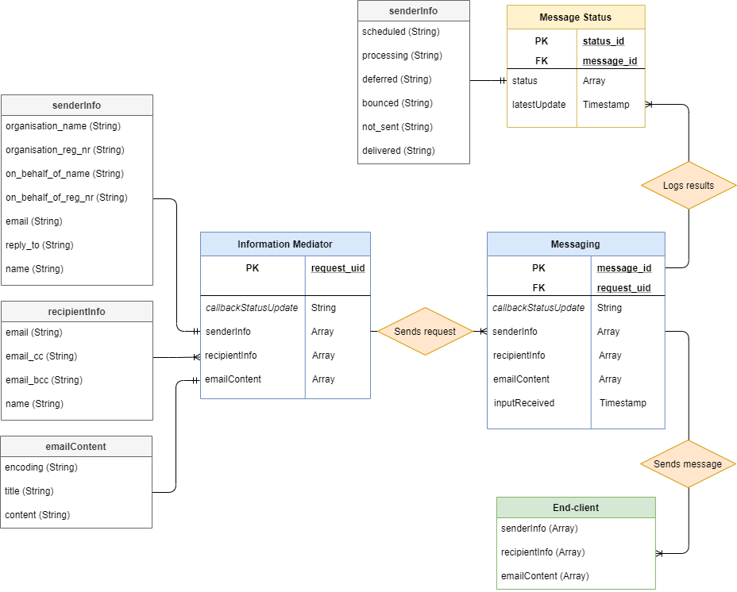

# 7 Data Structures

## 7.1 Resource Model

The resource model shows the relationship between data objects that are used by this Building Block.

<figure><figcaption>
<em>Note: Recommend using</em> <a href="https://app.diagrams.net/"><em>https://app.diagrams.net/</em></a> <em>to create the resource model and store in BuildingBlock repository (</em><a href="https://github.com/GovStackWorkingGroup/BuildingBlockAPI"><em>https://github.com/GovStackWorkingGroup/BuildingBlockAPI</em></a><em>)</em>
</figcaption></figure>

## 7.2 Standards:

The following standards are applicable to data structures in the Messaging Building Block:

* all services are provided as REST API requests;
* only Transport Layer Security (TLS) Server Name Indication (SNI) extension-compatible requests are allowed;
* REST calls and responses use JSON as the only allowed data format.

### **7.2.1 Standards**

1. Using [ISO 8601](https://www.iso.org/iso-8601-date-and-time-format.html) on dates and times is a MUST;
2. [UTF-8 character encoding](https://en.wikipedia.org/wiki/UTF-8) on text input is a MUST.

## 7.3 Data Elements:

The data elements provide detail for the resource model defined above. This section will list the core/required fields for each resource.  Note that the data elements can be extended for a particular use case, but they must always contain at least the fields defined here. Information about data elements will include:

1. Name;
2. Description;
3. Data Type;
4. Message body/text;
5. Communication channel;
6. Required/Optional flag;
7. Link to the applicable standard(s);
8. Notes.

_**Note**: The data elements for each entity in the resource model will also be represented in the OpenAPI schema_ ([GitHub repository](https://github.com/GovStackWorkingGroup/BuildingBlockAPI)).

### 7.3.1 Data Elements (Generic Example)

**7.3.1.1       Person**

| ID                   | Unique identifier             | Integer | Y |                                                                      | Generated by Building Block on creation       |
| -------------------- | ----------------------------- | ------- | - | -------------------------------------------------------------------- | --------------------------------------------- |
| Surname              | Family name                   | String  | Y |                                                                      |                                               |
| First Name           | First name                    | String  | Y |                                                                      |                                               |
| Birth Date           | DOB                           | Date    | N | [ISO 8601](https://www.iso.org/iso-8601-date-and-time-format.html)   |                                               |
| Mobile Number        | Phone number (mobile) of user | String  | Y | [E.164 Mobile number standard](https://www.itu.int/rec/T-REC-E.164/) | Should include country code                   |
| Government ID number | Government issued ID number   | Integer | N |                                                                      | Used when linking to global ID building block |

### **7.3.2 Model Schemas**

Each model schema MUST have a corresponding JSON Schema ([API definition file](https://raw.githubusercontent.com/GovStackWorkingGroup/BuildingBlockAPI/main/ExampleSchema.json)).
