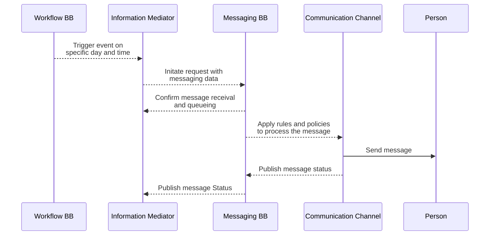
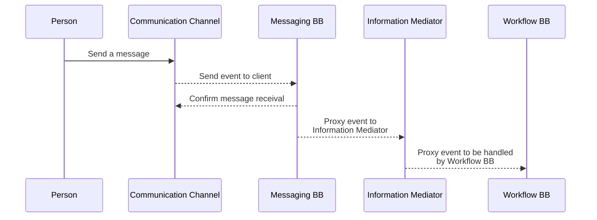

# 9 Workflows

A workflow provides a detailed view of how this building block will interact with other building blocks to support common use cases.

This section lists workflows that this building block must support. Other workflows may be implemented in addition to those listed.

## 9.1    Standards

&#x20;****&#x20;

The workflows MUST adhere to all standards defined in this document as well as in the GovStack architecture document (link to appropriate section in architecture document)

## 9.2   Workflow diagram 

### 9.2.1 Prerequisites and dependencies 

The main prerequisite for **Bulding Block (BB) to Person** communication is that there is an existing Sender/Source BB with the following properties:

1. the relevant credentials and details about the Person/Citizen to be addressed with
2. the content of the message, and a reference to a communication channel (contact details) to be used.
3. additionally the service discovery service at the Information Mediator BB needs to be active. IM BB publishes the list of available services of the Messaging BB to the source GovStack BB, i.e. Workflow.

A reference token should be carried throughout the communication session in order to save a point of reference for reverse communication back from the Person to the BB. In another words, the main prerequisite for Person-to-BB communication is the availability of communication channel and a reference token.

#### **9.2.1.1      Description**

This generic workflow is used to transfer messages between GovStack Building Block (BB) and the end user, Person. Data is submitted from a GovStack BB front-end application. This workflow shows a connection to Gov(Stack) building block (such as a government Health System Application) to convey a message that is associated with a real person.

#### **9.2.1.2      Interaction with Other Building Blocks**

This workflow requires interaction with the _Information Mediator_ and a source GovStack Building Block, for example a Health Care Service BB or registry BB.

#### **9.2.1.3      Sequence Diagram**

The sequence diagram shows the flow of data between building blocks for this workflow.

#### Messaging: Government to Person (G2P)

#### Messaging: Person to Government (P2G)

## **9.3 Interactions**

### **7.3.1 Government/BB to Person communication**

****

| Sender BB: Identification of the Recipient /Person | 
Sender/Publisher BB service application to retrieve relevant

Person and Contact Channel Data
 | Data structure may contain additional elements                                                                                  |
| -------------------------------------------------- | --------------------------------------------------------------------------------------------------------- | ------------------------------------------------------------------------------------------------------------------------------- |
| Validate Person and Contact Channel Data           | Link to appropriate data structure in the relevant GovStack building block (Registry/Service)             | Inform user if record already exists and return unique identifier                                                               |
| Internal De-duplication Search                     | Person and Contact Channel Data Structure                                                                 | Return a ‘Record Exists’ message to the user if it is already in the registration database                                      |
| Create Message Record                              | Person and Contact Channel Data Structure                                                                 | 
Generate unique ID for this record (auto-increment)

Create unique token to be carried through the delivery process
 |
| Publish Message through Communication Channel      | Communicate Message Data and User ID to Communication Channel                                             | Data structure may contain additional elements                                                                                  |
| Deliver message to the person                      | Internal Data Structure from the respective channel                                                       | Internal Data structure from Communication Channels may contain additional elements                                             |
| Publish Status for the original sender             | User and Message IDs with Delivery Status containing date and time                                        | The Message unique ID is preserved to keep up its status updated                                                                |

### **9.3.2** Person to Government/BB communication

| Person: Messaging receival from the communication channel | Text message and User ID                                                                                      | Internal Data structure from Communication Channels may contain additional elements    |
| --------------------------------------------------------- | ------------------------------------------------------------------------------------------------------------- | -------------------------------------------------------------------------------------- |
| Communication Channel: Send event to client               | Communicate Message Data and User ID to Communication Channel                                                 | Data structure may contain additional elements                                         |
| Messaging BB: Confirm message receival                    | Message Delivery Data Structure following Communication Channel standards with Status                         | The Message unique ID is collected to keep up other statuses updated                   |
| Information BB: Identification of the Recipient /Person   | 
Information Mediator BB service application to retrieve relevant

Person and Contact Channel Data
 | Data structure may contain additional elements                                         |
| Validate Person and Contact Channel Data                  | Link to appropriate data structure in the relevant GovStack building block (Registry/Service)                 | Check if the record already exists and return a unique identifier or create one if not |
